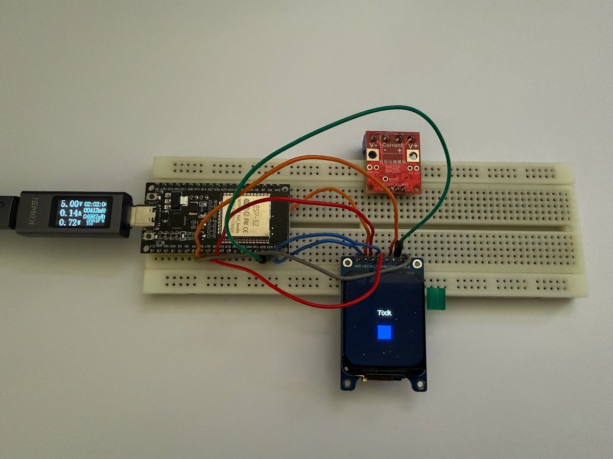

# Build Log — Iteration 1

ESPHome & Display Integration

This first iteration focuses on bringing up ESPHome on the ESP32 and validating the connection and behavior of the attached  display.

## Scope of This Iteration

- Flash ESPHome on an ESP32  
- Establish OTA (Wi‑Fi) workflow  
- Connect and configure the display  
- Identify and resolve early display instability issues  
- Validate basic rendering on the screen  

## Hardware Used

- **1.69" TFT LCD IPS display module**  
  Controller: **ST7789**
- **ESP‑32S (ESP‑WROOM‑32)**  

## ESPHome Setup

Getting ESPHome running on the ESP32 was straightforward:

1. A new device was created in ESPHome.
2. An initial firmware image was generated.
3. This firmware was uploaded to the ESP32 via the browser.
4. Once flashed, the device was automatically discovered on the network.
5. From that point on, the YAML configuration could be edited and flashed over Wi‑Fi (OTA).

This OTA workflow significantly speeds up development and testing.

## Display Wiring & Connection

The display was connected to the ESP32 using a breadboard for early testing.  
After wiring, the ST7789 display was configured using ESPHome’s display component.

### Wiring Schematic

> *Add wiring diagram here*

## Display Resolution Discovery

During initial testing, the bottom ~40 pixels of the display showed garbled output.

- The AliExpress listing specified a resolution of **240×280**
- Testing revealed the panel actually runs at **240×320**

This discovery explains the visual artifact and was a pleasant surprise, the extra vertical resolution is definitely a bonus.

## Boot Instability & Brownout Issue

While flashing the firmware worked reliably, a problem appeared on reset or power‑cycle:

- Sometimes the screen initialized correctly
- Often it showed random noise or corrupted pixels
- Behavior was inconsistent across reboots

This strongly suggested a brownout or power instability, most likely occurring when:

- the ESP32 boots
- Wi‑Fi initializes (high current draw)

### Solution Applied

The issue was resolved by delaying display initialization using:

```yaml
setup_priority: -100
```

This postpones the display setup until later in the boot sequence, after the ESP32 and Wi‑Fi have stabilized.

### Planned Improvement

To further stabilize the power rail, a small decoupling capacitor will likely be added near the ESP32/display supply in a future iteration.

### Current ESPHome Display Configuration

Below is the full display configuration currently in use:

```yaml
display:
  - platform: st7789v
    id: my_display
    model: Custom

    width: 240
    height: 320
    offset_width: 0
    offset_height: 0

    cs_pin: GPIO22
    dc_pin: GPIO16
    reset_pin: GPIO17
    backlight_pin: GPIO4

    data_rate: 10MHz
    invert_colors: true
    eightbitcolor: true

    setup_priority: -100

    update_interval: 1s

    lambda: |-
      static int counter = 0;
      counter++;
      it.fill(Color(0, 0, 0));
      if (counter % 2 == 0) {
        it.print(120, 140, id(my_font), Color(0, 255, 0),
                 TextAlign::CENTER, "Tick");
        it.filled_rectangle(100, 180, 40, 40,
                             Color(255, 0, 0));
      } else {
        it.print(120, 140, id(my_font), Color(255, 255, 255),
                 TextAlign::CENTER, "Tock");
        it.filled_rectangle(100, 180, 40, 40,
                             Color(0, 0, 255));
      }
```

### Visual Output Test

This configuration renders:

- A “Tick” / “Tock” text alternating every second
- A red / blue rectangle alternating in sync with the text

This simple animation is used to validate:

- screen refresh
- color handling
- font rendering
- stability across repeated updates



---
