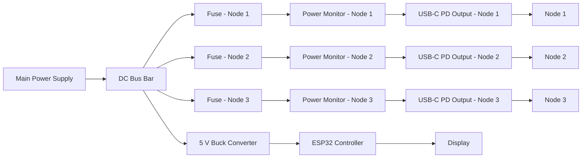
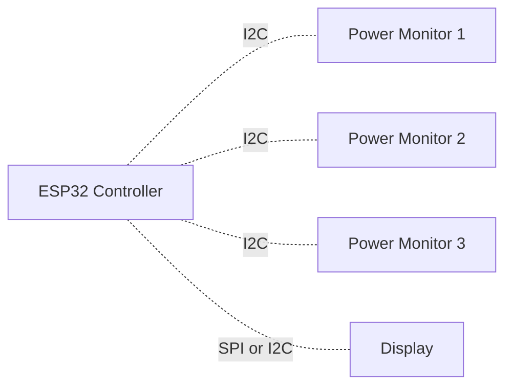

# 1U Power Delivery Module

## Summary

The 1U Power Delivery Module is intended to centralize power delivery for the homelab rack.

Instead of using multiple external power adapters or power bricks, this design introduces a dedicated 1U rack-mounted unit that distributes power to several nodes through independent USB-C Power Delivery channels. Each node receives its own isolated power path, its own power measurement, and its own negotiated USB-C PD connection.

The goal is to create a cleaner, more maintainable, and more observable power setup for the lab.

## Goals

The module is designed with the following goals in mind:

- centralize node power delivery in a single rack unit
- reduce cable clutter and eliminate loose external power bricks
- provide one dedicated USB-C PD output per node
- measure power consumption per node
- expose power telemetry to Home Assistant through ESPHome
- provide a local display for live power metrics

## Design Principles

### Independent power path per node

Each node should have its own dedicated power path, including:

- branch protection
- per-node power measurement
- independent USB-C PD negotiation

This ensures that connecting or disconnecting one node does not interfere with the power delivery behavior of another node.

### Per-node observability

Each output channel should provide individual power measurements so that node-level power usage can be monitored, visualized, and compared over time.

### Local and remote visibility

Power metrics should be available in two places:

- locally on a front-mounted screen
- remotely in Home Assistant through ESPHome

## Planned Features

The current concept includes the following features:

- USB-C based power delivery for rack nodes
- one dedicated PD module per output
- one power monitor per output
- ESP32-based monitoring controller
- ESPHome integration
- local screen for live telemetry

## High-Level Architecture

### Power Path

### Monitoring and Control Path

## Functional Overview

### Main power input

A central power supply feeds a shared internal DC bus. From this bus, power is distributed into multiple independent output branches.

### Branch protection

Each output branch includes its own fuse. This provides fault isolation and prevents a failure on one output from directly affecting the others.

### Power measurement

Each branch includes a dedicated power monitor. This allows the system to measure each node individually instead of only measuring total rack consumption.

### USB-C PD output per node

Each node is powered through its own USB-C PD module. This keeps power negotiation isolated per output and allows future flexibility if different node profiles are required.

### Monitoring controller

An ESP32 acts as the central monitoring controller. It reads data from the power monitors, updates the local display, and publishes telemetry through ESPHome.

### Local display

A small display is planned for the front panel so that the module can show live measurements without requiring Home Assistant or a laptop.

### Software Integration

The monitoring controller is intended to expose the following metrics through ESPHome:

- bus voltage per node
- current per node
- power per node
- optional accumulated energy per node
- module-level health or status indicators

These values can then be used in Home Assistant for:

- dashboards
- historical analysis
- alerts
- automation
- power trend comparisons between nodes

## Benefits

This design is expected to provide several practical benefits:

- cleaner rack cabling
- fewer external adapters
- centralized power distribution
- per-node power visibility
- a more purpose-built rack power solution

## Risks and Considerations

This design will ofcourse introduce a couple of noteworhty downsides

- single point of failure (power supply)
- unknown long term reliablilty
- the 1U form factor may limit cooling and cable routing options
- startup current spikes may influence fuse sizing and power budgeting
- measurement accuracy depends on correct shunt selection and calibration

## Current Assumptions

The current concept is based on the following assumptions:

- the rack nodes can be powered through USB-C PD via USB-C to plug adaptors
- each node benefits from an isolated PD output
- per-node measurement is more useful than only measuring total consumption
- the ESP32 has enough I/O and bus capacity for the planned number of channels
- a 1U form factor is sufficient for the required electronics and cooling

These assumptions still need to be confirmed during prototyping.
